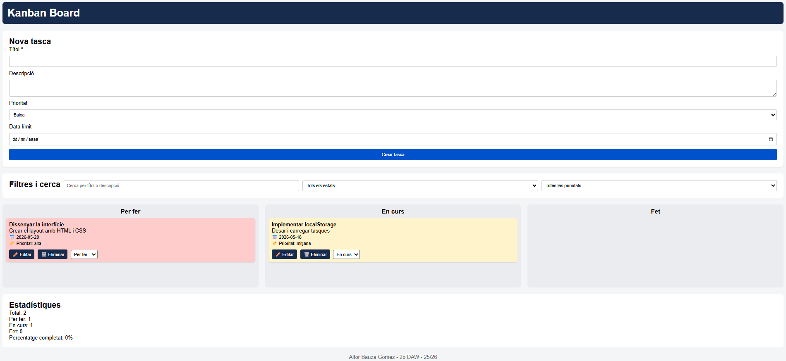
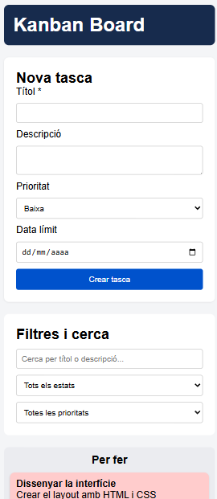
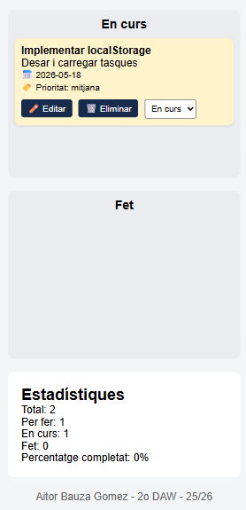

# Kanban Board

## Descripció

Aplicació web de gestió de tasques tipus Kanban que permet organitzar el treball en tres columnes: Per fer, En curs i Fet. Les tasques es guarden al navegador mitjançant localStorage, per tant es mantenen encara que es tanqui o recarregui la pàgina.

## Funcionalitats

- Crear, editar i eliminar tasques
- Moure tasques entre columnes mitjançant un selector d'estat
- Filtres per estat i prioritat
- Cerca per text (títol o descripció)
- Estadístiques en temps real (total de tasques, quantitat per estat i percentatge completat)
- Disseny responsive que s'adapta a pantalles petites
- Persistència de dades amb localStorage

## Estructura del projecte
```
kanban-board/
├── index.html
├── css/
│   └── estils.css
├── js/
│   ├── model.js
│   ├── storage.js
│   ├── ui.js
│   ├── crud.js
│   ├── events.js
│   └── main.js
├── img/
└── README.md
```

## Guia ràpida d'ús

### Crear una tasca

1. Ompliu el formulari amb el títol (obligatori), descripció, prioritat (color diferent per prioritat) i data límit.
2. Feu clic al botó "Crear tasca".
3. La tasca apareixerà a la columna "Per fer".

### Editar una tasca

1. Feu clic al botó "Editar" de la targeta que voleu modificar.
2. El formulari es preomplirà amb les dades actuals.
3. Modifiqueu el que necessiteu i feu clic a "Guardar canvis".

### Eliminar una tasca

1. Feu clic al botó "Eliminar" de la targeta.
2. Confirmeu l'eliminació a la finestra emergent.

### Moure una tasca entre columnes

1. Utilitzeu el selector desplegable de cada targeta.
2. Trieu l'estat nou: "Per fer", "En curs" o "Fet".
3. La tasca es mourà automàticament a la columna corresponent.

### Filtrar i cercar tasques

- Utilitzeu el camp de cerca per trobar tasques per títol o descripció.
- Utilitzeu el selector d'estat per veure només les tasques d'una columna.
- Utilitzeu el selector de prioritat per filtrar per prioritat.
- Els filtres es poden combinar entre ells.

### Estadístiques

A la part inferior es mostren:
- Nombre total de tasques
- Quantitat de tasques a cada estat
- Percentatge de tasques completades (estat "Fet")

## Tecnologies utilitzades

- HTML5 (etiquetes semàntiques)
- CSS3 (Flexbox, Grid, media queries per responsive)
- JavaScript (ES6)
- localStorage per a la persistència de dades
- Git i GitHub per al control de versions
- GitHub Pages per al desplegament

## Enllaços

- Repositori GitHub: https://github.com/aitorbauza/kanban-board
- Web desplegada (GitHub Pages): https://aitorbauza.github.io/kanban-board/

## Captures de pantalla

### Vista escriptori



### Vista mòbil

<div style="display: flex; gap: 10px;">
  
  
</div>

## Autor

Aitor Bauza Gomez - 2n DAW - Curs 2025/2026
```